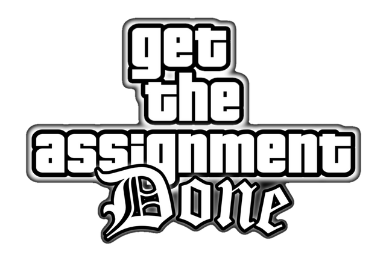
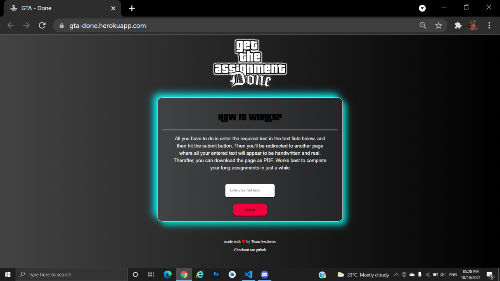
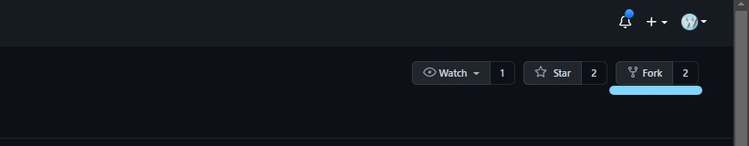
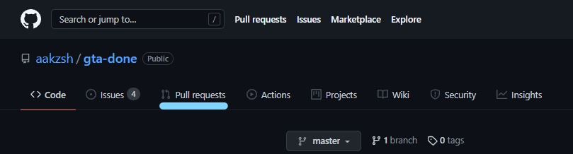

<br>

## gta-done(or Get the Assignment – done)
Are you a student who is bored of writing his/her long assignments and making pdf of it and then submitting it. So here we are, came up with a website named gta-done(Get the Assignment – Done) that makes this process easy for you. 

<br>

## What website does?
Basically it take input as word, sentence or paragraph including punctuations anything you want to add in your PDF and output these words in handwritten form and then you can download it as PDF and submit it as your assignment.

### 1. On this page user can input the text.


<br>
### 2. This is the output page from where user can download PDF.


<br>

## Tech & Tools used for this project
<a href="https://palletsprojects.com/p/flask/">  </a>
<a href="https://www.python.org/about/">  </a> 


<a href="https://code.visualstudio.com/docs">  </a>

<br>

## Executing this project on your PC
-	You need to clone this repository on your PC
-	In the terminal enter following command to download required resources 
```
pip install -r requirements.txt
```
-	To run this WebApp enter following in the terminal
```
python app.py
```

<br>


## How you can contribute 
### You can contribute to this project by –
### 1.	Forking this repository


<br>
### 2.	Commiting your changes
<br>

### 3. Creating a Pull Request


